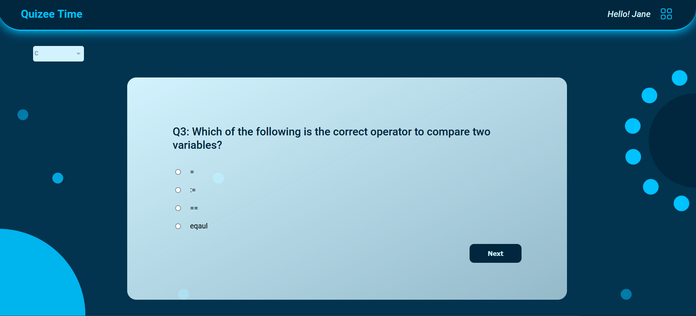

[![Contributors][contributors-shield]][contributors-url]
[![Forks][forks-shield]][forks-url]
[![Stargazers][stars-shield]][stars-url]
[![Issues][issues-shield]][issues-url]
[![MIT License][license-shield]][license-url]
[![LinkedIn][linkedin-shield]][linkedin-url]


<!-- PROJECT LOGO -->
<br />
<p align="center">
  <a href="https://github.com/mg143pavankumar/Quizee-Time">
    
  </a>

  <h3 align="center">Quizee-Time</h3>

  <p align="center">
    Online platform where students can enhance their skills by testing themselves. 
    <br />
    <a href="https://github.com/mg143pavankumar/Quizee-Time
"><strong>Explore the docs »</strong></a>
    <br />
    <br />
    <a href="https://github.com/mg143pavankumar/Quizee-Time
">View Demo</a>
    ·
    <a href="https://github.com/mg143pavankumar/Quizee-Time
/issues">Report Bug</a>
    ·
    <a href="https://github.com/mg143pavankumar/Quizee-Time
/issues">Request Feature</a>
  </p>
</p>


<!-- TABLE OF CONTENTS -->
## Table of Contents

* [About the Project](#about-the-project)
  * [Built With](#built-with)
* [Getting Started](#getting-started)
  * [Prerequisites](#prerequisites)
  * [Installation](#installation)
* [Roadmap](#roadmap)
* [Contributing](#contributing)
* [License](#license)
* [Contact](#contact)
* [Acknowledgements](#acknowledgements)


<!-- ABOUT THE PROJECT -->
## About The Project




Online platform where all user all over the world can test their skills and can improve their interview skills by answering following quize question.
The purpose of Quizee Time website is to make users to be more comfortable during their interviews.

### Built With

* [Nextjs](https://nextjs.org/)
* [Mongoodb](https://www.mongodb.com/)
* [Styled-Components](https://styled-components.com/)


<!-- GETTING STARTED -->
## Getting Started

To get a local copy up and running follow these simple steps.

### Prerequisites

This is an example of how to list things you need to use the software and how to install them.
* npm
```sh
npm install npm@latest -g
```

### Installation

1. Clone the repo
```sh
git clone https://github.com/mg143pavankumar/Quizee-Time.git
```
2. Install NPM packages
```sh
npm install
```

<!-- ROADMAP -->
## Roadmap

See the [open issues](https://github.com/mg143pavankumar/Quizee-Time/issues) for a list of proposed features (and known issues).


<!-- CONTRIBUTING -->
## Contributing

Contributions are what make the open source community such an amazing place to be learn, inspire, and create. Any contributions you make are **greatly appreciated**.

1. Fork the Project
2. Create your Feature Branch (`git checkout -b feature/AmazingFeature`)
3. Commit your Changes (`git commit -m 'Add some AmazingFeature'`)
4. Push to the Branch (`git push origin feature/AmazingFeature`)
5. Open a Pull Request


<!-- LICENSE -->
## License

Distributed under the MIT License. See `LICENSE` for more information.


<!-- CONTACT -->
## Contact

Mistry Pavan Kumar  - [@mg143pavankumar](https://twitter.com/mg143pavankumar) - pavansharma.mg143@gmail.com

Project Link: [https://github.com/mg143pavankumar/Quizee-Time](https://github.com/mg143pavankumar/Quizee-Time)


<!-- ACKNOWLEDGEMENTS -->
## Acknowledgements

* [react-hook-form](https://react-hook-form.com/)
* [axios](https://axios-http.com/docs/intro)
* [styled-Components](https://styled-components.com/)
* [bcryptjs](https://openbase.com/js/bcryptjs/documentation)


<!-- MARKDOWN LINKS & IMAGES -->
<!-- https://www.markdownguide.org/basic-syntax/#reference-style-links -->
[contributors-shield]: https://img.shields.io/github/contributors/mg143pavankumar/Quizee-Time.svg?style=flat-square
[contributors-url]: https://github.com/mg143pavankumar/Quizee-Time/graphs/contributors
[forks-shield]: https://img.shields.io/github/forks/mg143pavankumar/Quizee-Time.svg?style=flat-square
[forks-url]: https://github.com/mg143pavankumar/Quizee-Time/network/members
[stars-shield]: https://img.shields.io/github/stars/mg143pavankumar/Quizee-Time.svg?style=flat-square
[stars-url]: https://github.com/mg143pavankumar/Quizee-Time/stargazers
[issues-shield]: https://img.shields.io/github/issues/mg143pavankumar/Quizee-Time.svg?style=flat-square
[issues-url]: https://github.com/mg143pavankumar/Quizee-Time/issues
[license-shield]: https://img.shields.io/github/license/mg143pavankumar/Quizee-Time.svg?style=flat-square
[license-url]: https://github.com/mg143pavankumar/Quizee-Time/blob/master/LICENSE.txt
[linkedin-shield]: https://img.shields.io/badge/-LinkedIn-black.svg?style=flat-square&logo=linkedin&colorB=555
[linkedin-url]: https://linkedin.com/in/

